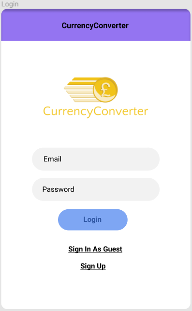
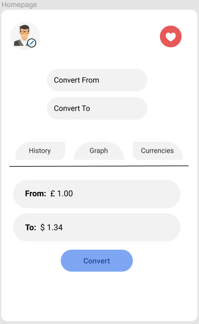
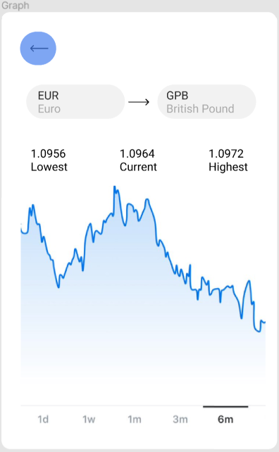
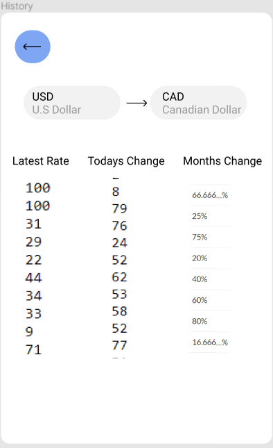
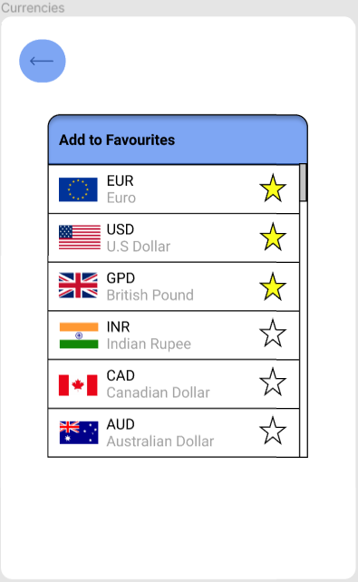
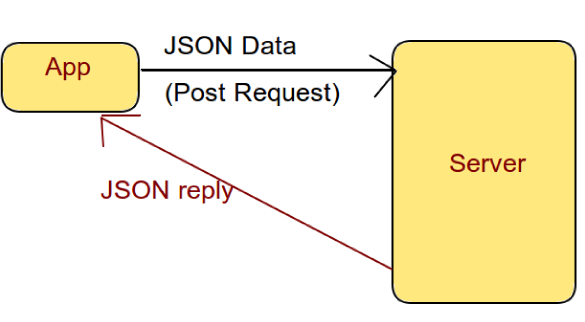
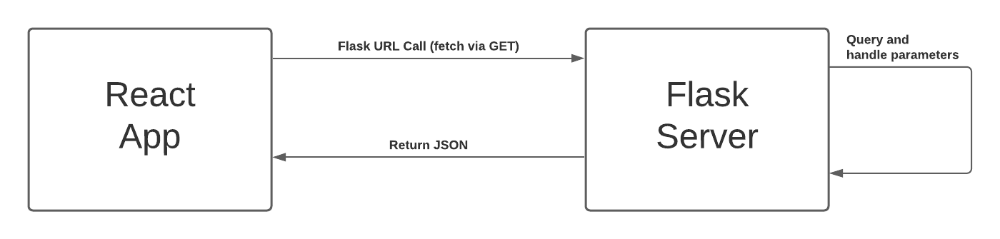

# Getting Things Started

## Date: Monday, November 3rd 2020

## Author(s): Trung Tinh Lien & Vincent Achukwu

After discussions about our various project ideas via email with our supervisor Donal Fitzpatrick, we decided to go with the Currency Converter mobile application. We held a short meeting the previous day via Zoom with our supervisor and discussed in further detail about the features we plan to implement to our mobile application. Our supervisor agreed to supervise our project and we began working on the proposal. Once we finalised the functionalities and features of the mobile application, we submitted the project proposal to our GitLab repo and awaited for project approval.

# Presentation Slides:

## Date: November 6th, 2020

## Author(s): Trung Tinh Lien

Created presentation slides, to prepare for presentation to be given about the project.

# Functional Specification & Some Back-End

## Date: Monday, November 9th 2020

## Author(s): Vincent Achukwu

I got the functional specification template from the CA326 site and simply added the necessary headings needed for the document. Decided to get things done earlier so we would have more time to do any refinements. Also, I implemented some functions to work with the API and testing out how the data is being sent/retrieved based on the inputs to the program. Will need to get this working on the terminal, for now, to test for user inputs instead of hardcoding currency codes. For example, when running the program, the user will be asked to enter currency codes to convert from and to, and the amount to convert from, after which the result will be printed.

# Back-End Code Update

## Date: Monday, November 18th 2020

## Author(s): Vincent Achukwu

I’ll need to do some more research as to how the front-end and back-end can deal with the inputs and outputs for the user to handle. So far, I have the program saving the output to a text file in JSON format, assuming that the front-end can read it and display it to the user on the screen, but I will have to do more research on that. I’ve implemented 3 functions:

- Currency converter: asks the user to enter the currency to convert from and to via currency codes, and the amount to convert from. The result is printed and the inputs and output are saved to the JSON text file.
- Rates: asks the user to enter currency codes separated by whitespace after which the program returns the latest currency exchange rates on those currencies. Again, this information is saved in a text file in JSON format.
- Abbreviations: the user enters the currency codes in the same, only this time, it returns the abbreviation of the currency codes they inputted. This is also saved to a text file in JSON format.

# Functional Specification Updates

## Date: Monday, November 21st 2020

## Author(s): Vincent Achukwu & Trung Tinh Lien

We’ve further updated the functional specification document, ensuring that each section is described appropriately and in the correct format. We now just need to discuss the High-Level Design and Preliminary Schedule and plan our schedule for the next steps in our project deliverables and implementations.

# Frontend UI Update

## Date: Saturday, 5th December 2020

## Author(s): Trung Tinh Lien

Started Mock Up for Currency Converter app. Starting with the login menu. Users will have the option to log in to an existing account, or to sign in as a guest, or to sign up as a new member (So they have the favourites feature).

Going with a minimalistic design approach for the Homepage as we don’t want the UI cluttered with unnecessary junk. We want users to know exactly where they are navigating to without being confused for a better user experience.

At the Homepage, users are able to directly convert their currency of choice. The Homepage contains Buttons that will navigate them to different pages that show different features, for example, “History” will navigate them to a new page that shows the updated currency of choice within the past month. “Graph” will show a graph of the past month’s update with the currency of choice. “Currencies” will give users the option of adding currencies to favourites, will also provide information about currencies, for example, abbreviation, symbol, flag.

It is essential that the convert button is not at the very bottom of the screen because nowadays on phones that is where the home button is.

Upon tapping the “Graph” button in the homepage, you will be directed to another page containing a graph from one currency to another. There will be the option to view the graph with the change in rates of currencies from 1 day, to 6 months.

There is also the feature which shows what the lowest, current and highest rates were over the past 6 months. This allows users to decide when it is best to convert their currency with the added benefit of having the information to invest if they decide to do so.

There is a large back button on the top right of the screen which will allow users to easily navigate back to the Homepage for a quick and easy user experience.

Since we want to cater to users with accessibility needs, we will also have a “History” page which will give users information on the rates of currencies in text form so that visually impaired users can have their screen readers read them detailed information on the changes that have occurred to currencies within the past month.

All users have to do is fill in what currency would they like to convert from and convert to. There will also be a back button up on the top left of the page which will redirect users back to the Homepage.

The “Currencies” page will bring the user to a page that will allow users to add their most used currencies to favourites. This is important as the favourites feature will allow users to be more efficient when they’re trying to find their currency.

This is the table that is shown when users are choosing their currency to convert from and to convert to. The currencies that are favourited will always show at the top of the table.

We believe this feature will allow for an even quicker and easier user experience.

# Created Temporary DFD

## Date: Saturday, 5th December 2020

## Author(s): Vincent Achukwu

Added a temporary Data Flow Diagram for the High-Level Design description in the functional specification.

# Feedback on Functional Spec

## Date: Tuesday, 15th December 2020

## Author(s): Vincent Achukwu, Trung Tinh Lien

We held a meeting regarding feedback on our functional specification. After making the Word doc version, we converted the document into Markdown and fixed the issues which our supervisor pointed out to us. This meeting was important for us since feedback was very necessary prior to the submission of the document.

# More Back-End Testing

## Date: Wednesday, 13th January 2021

## Author(s): Vincent Achukwu

Upon testing the simple prototype, I added the historic rates and currency time-series functionality. As expected, it’s slower to have a function manually iterating through dates and getting exchange rates for a currency for each day within the time range. We may have to go for one of the paid subscriptions to achieve better functionality which also includes other features.

# Frontend UI Weekly Update

## Date: Monday 18th - Sunday 24th, January 2021

## Author(s): Trung Tinh Lien

**Monday 18th - Wednesday 20th**
After spending an unnecessarily long amount of time, trying to set up react-native-cli, I decided to use expo-cli since it was a much more simple setup. After setting up the screens and navigation around the pages in the expo-cli app, After messing around on the app for a while, I realised there were some libraries that would make the App look much better that did not support expo-cli. After some consideration, I decided to spend some more time getting react-native-cli to work and succeeded with the help of:  

https://reactnative.dev/docs/environment-setup

**Thursday 21st**
Since the navigation across screens was more or less finished in the expo-cli version, this translated really well when setting it up for react-native-cli, just had to install the dependencies for react-native. Finished the login and signup screens.

The login and signup screens were created by following a tutorial:  
_Login & Signup Screen UI Design Tutorial in React Native_  
https://www.youtube.com/watch?v=Rs72pRwXIzA&t=661s

**Friday 22nd**
Set up a bottom tab navigation feature for the app. This would allow Users to navigate to some screens through the bottom tab, along with a drawer feature that allows users to access some other less important screens, for example, support, about us.

The bottom tab navigation was created using this tutorial:  
_Material Bottom Tab Navigatior in React Navigation v5 | Bottom Tab Navigation Tutorial_  
https://www.youtube.com/watch?v=RSzITFbOtpQ&t=7s

**Saturday 23rd**
Set up a dark theme feature for users on the drawer tab that would translate across all screens.

The dark theme feature was implemented using this tutorial:  
_Dark Theme in React Native Tutorial | Switching Between Light and Dark Theme_  
https://www.youtube.com/watch?v=km1qm1Zz2lY&t=459s

**Sunday 24th**
Trying to set up a feature for users to be able to change profile pictures from camera or gallery. (unfinished)

# Frontend UI Weekly Update

## Date: Monday 25th - Sunday 31st, January 2021

## Author(s): Trung Tinh Lien

**Monday 25th - Wednesday 26th**
Installed and Setup Firebase database.

**Thursday 27th - Sunday 31st**
Fixed up the Login/Signup screen and fixed the screen orientation to Portrait Mode.

# Frontend to Backend Connection

## Date: Monday 1st February 2021

## Author(s): Vincent Achukwu

After spending some time on learning more about frontend development, fixing issues on my end and figuring out how to view our app on a physical device via USB, and the various ways of connecting frontend to backend, I finally managed to get a basic flask backend program to connect to the frontend. I searched various articles and forums online as to how to achieve this connection so we could have the inputs from the frontend to be passed to the backend, the backend handles with those inputs, and returns output back to the frontend. I used the blogs and forums below for guidance:

- https://blog.miguelgrinberg.com/post/how-to-create-a-react--flask-project
- https://stackoverflow.com/questions/56789493/fetch-is-not-working-on-a-real-device-in-react-native

# Supervisor Meeting

## Date: Thursday 11th February 2021

## Author(s): Vincent Achukwu, Trung Tinh Lien

We updated our supervisor as to how we were getting on so far, anything that’s yet to be done, and also talked about ethics. We learned that we are to constantly have tests documented for our application in order to ensure good functionality. Essentially the frontend and the backend will have to have unit tests. We also updated our ethics form for our supervisor to give feedback on it.

The main thing now is to get the frontend to send inputs to the backend and then clean up some of the design elements of the mobile application, as well as write unit tests for both the frontend and backend and document this.

# Flask API Update

## Date: Monday 22nd February 2021

## Author(s): Vincent Achukwu

After researching how to pass inputs from React Native to Flask, I managed to get it working locally via POST/GET requests. I was using the AboutUs page for testing the way the front end text fields can pass inputs to the Flask backend, after which the Flask backend uses the Fixer API to retrieve data with those inputs, and then the Flask API returns a dictionary data structure which the front end retrieves via JSON and displays the result. The backend I wrote from around October essentially now has each method in a route of its own (e.g convert() is in the /api/conversions route). Here are some of the guides I used to make progress:

[Call Flask API in React](https://www.youtube.com/watch?v=06pWsB_hoD4)  
[Enable Button After Form Fields are Non-Empty](https://stackoverflow.com/questions/50516966/react-enable-button-after-all-form-fields-are-not-empty/50517932)

The Flask API is also deployed so the React Native front end doesn’t require the use of the user’s IPv4 when running the app locally. So instead of passing a local URL, the deployed Flask API URL is used. The issue is how to deal with POST requests using the deployed Flask app. The deployed Flask API doesn’t seem to read POST requests which I’ll have to look into in more detail. For now, I’ll have to get the other features to work with the front end-back end communication.

# Frontend Testing Update

## Date: Thursday 18th February 2021

## Author(s): Trung Tinh Lien

After our meeting with our supervisor Donal Fitzpatrick, He recommended us to start with the testing as soon as possible. This was required in our 3rd year project and worth a good amount. For the frontend, I configured Jest test settings which would allow me to mock modules that can be ignored within the project.

For 2 days, Some Unit tests were added for the project, for example, rendering tests that test for the rendering of each screen, button tests to test if a button is working when clicked onto it … etc.

# Frontend Currency Data and Favourites Table

## Date: Saturday - Monday, 20th - 22nd February 2021

## Author(s): Trung Tinh Lien

Created data structure for currencies which includes an ID number, abbreviations, names, flag. Also added AddToFavourites screen which lists this data in a list format for users, with a heart icon that changes colour when clicked.

Added another bottom tab screen called Favourites.

# Flask Deployment and Unit Tests

## Date: Wednesday 24th February 2021

## Author(s): Vincent Achukwu

The Flask backend server worked fine locally when running the app and sending requests from the frontend to the backend, but upon deploying the Flask app using pythonanywhere.com, there were issues regarding how to get requests to be sent to the Flask app. It was important to get this to work since we do not want users to have to specify their IP address in order to use the application on their end for the frontend to fetch. Specifying the Flask server URL would be much better for the React Native front end to fetch from. Here’s a diagram demonstrating the initial idea:

  
_([Source](https://codeburst.io/integrating-react-native-apps-with-back-end-code-using-fetch-api-8aeb83dfb428))_

I then stumbled across this [StackOverflow](https://stackoverflow.com/questions/15182696/multiple-parameters-in-flask-approute) post regarding passing parameters to Flask API endpoints (via URL), in which you can get the parameters passed in via request.get.args(). We also learned about this in our Networks 2 Module (CA304). This worked flawlessly and as expected and no longer requires us to specify IP addresses for testing, as well as deployment. The diagram below demonstrates the frontend-backend communication:

We will also have to look into how to deploy the React Native side.

# Frontend Update

## Date: 23rd Tuesday 2021 - 25th Thursday 2021

## Author(s): Trung Tinh Lien

After discussing with Vincent, since the input needs to be typed because the data table for the currencies is way too large, instead of a favourites tab and a table pop up, users will be able to search up the abbreviation of their currencies if they need it.

Also finalised the login authentication using firebase. Other than that, fixed up the home screen and the rates screen by adding some styling to it.

# Supervisor Meeting

## Date: 26th February 2021, 10:45

## Author(s): Vincent Achukwu, Tinh Lien

We had a meeting with Donal Fitzpatrick to update and discuss the progress made so far. He gave us tasks to get the graph working along with setting up an apk version of our app.

# Frontend Update

## Date: 27th February 2021 - 28th February 2021

## Author(s): Trung Tinh Lien

After the meeting with Donal, I set a graph by using the react-native-chart-kit module. Due to certain complications with the graph, instead of making the data span across 6 months it had to be reduced to 6 weeks, 1 day per week. Since it was the first time making a graph, it was unrealistic to span it across 6 months. Also added error handling for the graph, sign in and sign up screen.

Other than that, I finished up the Support, AboutUs and Information screens.

react-native-chart-kit React Native Library:  
https://github.com/indiespirit/react-native-chart-kit

# Backend Update

## Date: 27th February 2021 - 28th February 2021

## Author(s): Vincent Achukwu

Had to change the way the flask backend time series route returned the data to 6 weeks instead of 6 months.

# Finale

## Date: 1st March 2021

## Author(s): Vincent Achukwu, Tinh Lien

After months of work, our app was finally finished! we had to figure out how to deploy our react native app. After we got it down to an .aab file, we converted it to an .apk file and downloaded and tested on our own phones ourselves.

_How to deploy android apk:_  
_https://www.youtube.com/watch?v=Wvy8ACbP38I_

_How to convert .aab to .apk:_  
_https://stackoverflow.com/questions/53040047/generate-apk-file-from-aab-file-android-app-bundle_

# Finale Pt. 2

## Date: 5th March 2021

## Author(s): Vincent Achukwu, Tinh Lien

After doing some user testing, we realised that there were a few currencies that broke the graph and quickly fixed it by updating the error handling in the code. We then remade the app into an apk and published it for users to test again.
