# **Software Requirements Specification**
**Group Members:** Vincent Achukwu & Trung Tinh Lien
## **Currency Converter**

## **Table of contents**

  * [**1. Introduction**](#--1-introduction--)
    + [**1.1 Purpose**](#--11-purpose--)
    + [**1.2 Overview**](#--12-overview--)
    + [**1.3 Business Context**](#--13-business-context--)
    + [**1.4 Glossary**](#--14-glossary--)
    + [**1.5 References**](#--15-references--)
  * [**2. General Description**](#--2-general-description--)
    + [**2.1 Product / System Functions**](#--21-product-/-system-functions--)
    + [**2.1.1 Product Perspective**](#--211-product-perspective--)
    + [**2.1.2 Product Functions**](#--212-product-functions--)
      + [**2.1.2.1 Monthly Rates**](#--2121-Monthly-Rates--)
      + [**2.1.2.2 Graph**](#--2122-graph--)
      + [**2.1.2.3 Favourites**](#--2123-favourites--)
      + [**2.1.2.4 Flag,symbol,abbreviation,translation**](#--2124-Flag,symbol,abbreviation,translation--)
    + [**2.2 User Characteristics**](#--22-user-characteristics--)
    + [**2.3 Operational Scenarios**](#--23-operational-scenarios--)
      + [**2.3.1 Member Login**](#--231-member-login--)
      + [**2.3.2 Querying Exchange Rates**](#--232-querying-exchange-rates--)
      + [**2.3.3 View Graph Exchange Rates**](#--233-view-graph-exchange-rates--)
      + [**2.3.4 Adding Currency to Favourites**](#--234-adding-currency-to-favourites--)
      + [**2.3.5 Logging out/Deleting Account**](#--235-logging-out/deleting-account--)
    + [**2.4 Constraints**](#--24-constraints--)
      + [**2.4.1 Internet Constraints**](#--241-internet-constraints--)
      + [**2.4.2 Ease of use**](#--242-ease-of-use--)
      + [**2.4.3 Time Constraints**](#--243-time-constraints--)
      + [**2.4.4 Financial Constraints**](#--244-financial-constraints--)
      + [**2.4.5 Software Interfaces**](#--245-software-interfaces--)
      + [**2.4.6 Hardware Constraints**](#--246-hardware-constraints--)
  * [**3. Functional Requirements**](#--3-functional-requirements--)
    + [**3.1 External Requirements**](#--31-external-requirements--)
      + [**3.1.1 Software Interfaces**](#--311-software-interfaces--)
      + [**3.1.2 Communication Interfaces**](#--312-communication-interfaces--)
    + [**3.2 Functional Requirements**](#--32-functional-requirements--)
      + [**3.2.1 Currency Conversions**](#--321-currency-conversions--)
      + [**3.2.2 Monthly Rates**](#--322-monthly-rates--)
      + [**3.2.3 Graph Representation**](#--323-graph-representation--)
      + [**3.2.4 Member Login/Sign Up**](#--324-member-login/sign-up--)
      + [**3.2.5 Favourite Currency List**](#--325-favourite-currency-list--)
      + [**3.2.6 Search Currencies**](#--326-search-currencies--)
      + [**3.2.7 Currency Interpretation**](#--327-currency-interpretation--)
  * [**4. System Architecture**](#--4-system-architecture--)
    + [**4.1 Overview: Applications**](#--41-overview--applications--)
    + [**4.2 Components**](#--42-components--)
    + [**4.3 Services**](#--43-services--)
  * [**5. High-Level Design**](#--5-high-level---design--)
    + [**5.1 High-Level Design DFD**](#--51-high-level-design-dfd--)
    + [**5.2 High-Level Design Description**](#--52-high-level-design-description--)
    + [**5.3 Mockup UI**](#--53-mockup-ui--)
  * [**6. Preliminary Schedule**](#--6-preliminary-schedule--)
    + [**6.1 Gantt Chart**](#--61-gantt-chart--)
    + [**6.2 List View**](#--62-list-view--)

# 1 Introduction
## 1.1 Purpose
The purpose of this document is to describe the Currency Converter app for mobile applications. The aim of this application is to provide ease-of-use for users to find out the latest exchange rates for a variety of foreign exchange rates. This document includes information on the requirements and analysis of the project and reflects the identified constraints and functionalities.

## 1.2 Overview
The product we are designing is a Currency Converter app. The goal of this project is to allow users to follow the latest currency exchange rates on our mobile application. We aim to design this application in a simple and elegant user interface. This will reduce the need for users to have to access the browser in order to acquire this information, as a mobile application allows for quicker access and ease of use.

The application shall allow users to view the changes in rates that have occurred over the past month. The application will not allow users to purchase stocks. Alternatively, its main purpose is to simply give users a guide for the best time to convert their money, or do other business transactions outside the application. The exchange rates will be based on the inter-bank rate. Also, the application shall have a graph which gives a visual representation of the rates from the past month. The Currency Converter app shall have a favourites section, which allows users to add their most searched/used currencies, as this shall make it quicker for users to navigate what they searched for. It is also important that the application shall have various representations of each currency (e.g. a flag, symbol, and abbreviation). This shall make it easier for users to understand from which country the currency they are looking at is from, as not all users may be familiar with the currency code meaning.

These features shall provide users with ease of use of the application, good accessibility, and a satisfiable experience. We aim to make this application as simple and elegant as possible to provide users with the best possible user experience.

## 1.3 Business Context
The plan for our Currency Converter project is to make it into a phone application for accessibility and ease of use. This will require us to deploy our application on the Android app store in the "Apps" section.

## 1.4 Glossary
| **Term** | **Definition** |
| --- | --- |
| API | Application Programming Interface, allows applications to make requests to get data. |
| App | Mobile Application |
| GUI | Graphical User Interface |
| UI | User Interface |
| UX | User Experience |
| Server | A computer program which maintains access to a network. |

## 1.5 References

- Globalluxsoft, 2018. _Software Requirements Specification. What Do You Need To Know.._ [online] Available at: <https://medium.com/globalluxsoft/software-requirements-specification-what-do-you-need-to-know-22a6b8585945>
- Honig, R., 2019. _What is Database-as-a-Service?_ [online] Available at: <https://www.stratoscale.com/blog/dbaas/what-is-database-as-a-service/>
- Gazarov, P., 2019. _What Is An API? In English, Please.._ [online] freeCodeCamp.org. Available at: <https://www.freecodecamp.org/news/what-is-an-api-in-english-please-b880a3214a82/>
- TransferWise. 2018. _What Is The Interbank Exchange Rate? And Why Is It Such A Big Deal?._ [online] Available at: <https://transferwise.com/us/blog/interbank-exchange-rate-definition>

# 2. General Description

## 2.1 Product / System Functions
### 2.1.1 Product Perspective
The main goal is to make the application simple and easy to use with the features we are going to implement. The purpose of this application is to provide the user with up-to-date exchange rates from up to 170 currencies. It is not to be confused with a trading application. It is more of a guide to give the user information whether it is a good idea to convert their money when checking for exchange rates.

### 2.1.2 Product Functions
#### 2.1.2.1 Monthly Rates:

- This will allow users to see the changes in rates that have occurred over the past month, which will give the user information whether it is a good idea to convert their money at that specific time.

- Users can also view the most recent exchange rate for a selected currency.

- The API will request the data of the exchange rates depending on the user's query, and the requested data will be displayed in the app.

#### 2.1.2.2 Graph:

- This will be used as a visual representation of the monthly rates. It will show the trend of the exchange rate for a selected currency over the past month.

- This makes the app more readable and understandable for its visual representation of the trends.

#### 2.1.2.3 Favourites:

- This will show users favourite currencies (e.g. most used/searched for) that they added to their favourite list.

- Users can log in/sign up in the app in order to allow them to save certain currencies to their favourites.

- This feature will speed up the process of users obtaining the exchange rate information without constantly searching for their desired currency, making the application more accessible.

#### 2.1.2.4 Flag, Symbol, Abbreviation Translation:

- This is some visual representations of the currency to help users who are not well informed on the abbreviations of currencies.

- We plan on having a flag icon, symbol, and an abbreviation for each currency, allowing users to understand what each currency means and what country it is associated with. This will provide ease of use to our users and will satisfy their needs quickly.

## 2.2 User Characteristics
As this is a mobile application which retrieves data from an API for the latest currency exchange rates, and the rates are not being updated per-second, this application is available for users starting from ages 18+ and for those who need to know how much certain currencies are worth once in a while. It will be much more useful for the users to get the latest figures directly from the mobile application rather than using the browser as this will quickly inform them whether it is a good idea to convert their money at that specific time. The users will understand that this application is by no means where you can buy or sell a single stock, but rather serves the purpose of guiding users about the latest figures in the foreign exchange rates.

The users are expected to have some familiarity with mobile devices and applications. As this is a mobile application, this saves the user time in having to search for the latest exchange rate figures, making it easily accessible. Nonetheless, we aim to provide a seamless, user-friendly UI, and an easy to use application for our users with little or no hands-on experience, including users with accessibility needs. Without the need for a good understanding of how the underlying API works or the implementation overall, users will have the opportunity to focus on the exchange rates retrieved in the app.

## 2.3 Operational Scenarios
### 2.3.1 Member login:

- Users who are logged out or haven't created an account will have the option to log in or sign up with a valid email address and password.

- If the user enters the correct email and password, they can then access the system.

- If they do not enter the correct details, a message will appear on the screen informing them they have entered incorrect details and to try again.

### 2.3.2 Querying exchange rates:

- Once the user has access to the system with their account, they will be able to obtain exchange rates from 170 currencies.

- Users can obtain exchange rates from different time frames such as the currency exchange rates within the last month for specified currencies, or from earlier dates.

- They can do this by searching for the currency in the search bar. When querying for a currency, the user will be shown its corresponding flag as well as its abbreviation.

- This allows the user to understand the derivation and meaning of the currency.

### 2.3.3 View graph of exchange rates:

- A visual representation of the exchange rates trend from the last 30 days will be available to the user via a graph.

- After querying for a certain currency, they will be shown this graph on the screen.

- This will give them a better understanding of the trend in the currency exchange rates in a visual format.

### 2.3.4 Adding currency to favourites:

- Upon searching for currencies, the user can add their favourite currency to their favourites.

- This will speed up their search time rather than having to manually search for the currency for exchange rates.

- The user can select one or more currencies from the favourites list and can obtain the exchange rate figures from the selected currencies.

### 2.3.5 Logging out/Deleting account:

- The user can log out or delete their account at any time.

- If logged out, the user will be automatically logged and brought back to the login screen where they can register a new account or log back into the system.

- Upon deleting an account, the user's information will be deleted and will have to re-register in order to use the app.

## 2.4 Constraints
### 2.4.1 Internet constraints:

- Since this program depends on an internet connection, this is the most important constraint.

- As the exchange rates are being queried from the API, the user must have a stable internet connection in order to retrieve the data.

### 2.4.2 Ease of use:

- We will make sure that navigating through the mobile application is made easy and the choice of font, sizes of buttons and text, and colours will provide the user with a pleasant experience.

### 2.4.3 Time constraints:

- This project has a completion due date strictly set by DCU and as a result, we must make sure all requirements are met and the mobile application is fully operational by the deadline.

### 2.4.4 Financial constraints:

- The fixer.io API has limited features available in the free subscription of the service. However, there are more useful features available in the various paid subscriptions of the API service which can make it a lot easier to work with and handle the data.

### 2.4.5 Software interfaces:

- The mobile application will be limited within certain Android/IOS versions, but not the latest.

### 2.4.6 Hardware constraints:

- As this is a mobile application, the application is only supported on mobile	devices and not on PC/Laptop machines.

# 3. Functional Requirements
## 3.1 External Requirements
### 3.1.1 Software Interfaces:

- API: The application will be obtaining data from the fixer.io API which contains the latest figures of the currency exchange rates. The data is read in JSON format and based on what the user requests, the program will pass appropriate parameters to the API URL and retrieve the data.

### 3.1.2 Communication Interfaces:

- Communication between the user and the Fixer API endpoint will be served over HTTPS. The client roles and server roles must be separated by a uniform interface.

## 3.2 Functional Requirements
### 3.2.1 Currency conversions

- Description: Being the main feature of the application, the application can convert from one currency to another with the user being able to pass in a certain value (e.g. "how much is 20 Euro in British Pound Sterling?"). No matter what the base currency is, the application will do the necessary calculations to convert from one currency to another based on the current exchange rates.

- Criticality: Without this feature, the application wouldn't be of much use for the user, since this is the main feature of the mobile application. As well as viewing the exchange rates for each currency, the user shall be able to convert between different world currencies.

- Technical issues: One issue which may arise is if the user wants to convert between currencies which are not provided in the application. There are 180 world currencies, whereas our application supports 170 world currencies.

- Dependencies with other requirements: In order for the user to select the from and to currencies for conversions, this requirement is dependent on 3.2.6 (Currency Interpretation) requirement. This provides the user with ease-of-use to understand the meaning of each currency.

### 3.2.2 Monthly rates

- Description: Being one of the main features of the mobile application, users will be able to see the changes in the exchange rates each day for different currencies for the past month. The API updates the exchange rates database every hour. This allows for accurate figures to be presented in the application. The application will also allow the user to view historical rates, as early as 1999. This will be done with parameters passing to the API URL based on what the user queries.

- Criticality: The monthly and historical rates of each currency is a feature that gives the application more flexibility in searching for exchange rates, rather than simply viewing the current value of each currency.

- Technical issues: One of the main issues that can arise when querying for monthly or historical rates is the accuracy of the exchange rate for each currency. Since the free subscription of the fixer.io API has limited features, the free subscription updates the exchange rates every hour, whereas the paid features can have updates as soon as every 60 seconds.

- Dependencies with other requirements: As this feature provides the user with exchange rates from different dates or timeframes by querying currency, this is dependant on the currency interpretation functionality, as this would make it easier for the user to identify the currencies from their abbreviations and symbols.

### 3.2.3 Graph Representation

- Description: This feature provides the user with a visual representation of the exchange rates for each currency. If the user wants to view the rates from the last month, the graph will show the fluctuations from each day

- Criticality: The communication between the application and the API is critical as we need the graph to display the trend of the currency rates accurately. The graph must also be readable for the user and easy to understand.

- Technical issues: Such a requirement may be fairly straightforward to implement, but will essentially ensure fast load times and appropriate axis in the graph for readability. Since the graph provides a visual representation, we will also provide some extra form of accessibility to describe the graph (e.g. alt text, or other methods) to cater for those with accessibility needs.

- Dependencies with other requirements: Since this feature provides a visual representation of the trends from the last month or so for a currency, it is associated closely with the UI used for displaying the graph.

### 3.2.4 Member Login/Sign up:

- Description: Creating a profile is the first thing the user needs to do to access the system. The user can log in with an existing account, or sign up with a valid email address and password. Once that is done, the user has access to the system.

- Criticality: This feature is essential to the system for identification purposes. The process of signing up/logging in is essential for the user as they can access the system and see their favourite currency list saved in their account. This application also obtains data from the fixer.io API, and for security reasons, requires the user to have an account in order to view the exchange rates provided by the API.

- Technical issues: The main issue is to ensure that each account is unique and stored in the database correctly and safely. The user logged in must be correctly identified.

- Dependencies with other requirements: Since this feature allows users to have a personal list of favourite currencies they search for, this is associated with 3.2.5 (Favourite Currencies List) requirement, allowing the user to update the list throughout their usage of the application.

### 3.2.5 Favourite Currencies List:

- Description: After the user has access to the system by logging in or signing up, they then have access to the system and have the option to add their favourite currencies to their favourites list. The advantage of this feature is that it saves the user time from having to search for specific currencies from the app and this will greatly improve accessibility, allowing them to quickly navigate what they want to search for.

- Criticality: It is important that the favourites list is readable and easily accessible to the user. It is also essential that the favourites list is up to date and nothing added gets removed without the user's knowledge. Each time the user visits the favourites list, they expect to see what they decided should be there.

- Technical issues: This feature could be straightforward to implement, but it will be essential for this feature to be easily accessible to all users of the application. Therefore, the GUI implementation of this feature should promote readability, accessibility, and a navigable feature.

- Dependencies with other requirements: Since the user must be logged in to access system features such as this, this feature is associated with 3.2.4 (Member Login/Signup) requirement. This allows the user to save their list to their account.

### 3.2.6 Search Currencies:

- Description: This feature allows the user to query for currencies in the search bar by querying the database of currency exchange rates per character entry or deletion, after which displays the currency exchange rate. The search history will also be available in order to save time in querying for currencies, making the application easier to use and more accessible.

- Criticality: This feature is important since, without it, the user is limited by not being able to query for specific currencies in the database. The search feature also allows the user to quickly find currency exchange rates rather than looking through a list of all 170 currencies. For this reason, if this feature was not implemented, the application would still serve its purpose but adds a layer of difficulty in the usability of the UI.

- Technical issues: It is important that the implementation of this feature doesn't involve many difficulties, however, serves its purpose to the user. It is essential to ensure the accessibility of the search button, the output of the currency, displaying of the keyboard once the search button has been clicked, and the correct queries are made to the database when the user enters their query.

- Dependencies with other requirements: Since this functionality provides users to query for currencies, it is vital that this feature is associated closely with the UI which displays the currency the user queried and can see the exchange rate of that currency. The search feature will also be associated with 3.2.7 (Currency Interpretation) as it is important for the user to understand what each currency means.

### 3.2.7 Currency Interpretation

- Description: It is important that each user understands the meaning of each currency if they are not familiar with it. This feature allows the user to understand each currency by displaying its flag, symbol, and abbreviation. The flag can be displayed as a small icon beside the currency code.

- Criticality: As mentioned previously, the currency converter is the main feature of this application. To provide the user with ease-of-use of the application, it is important that they understand what each currency code means, since not all users may be familiar with them (e.g. EUR = European Euro, and a European flag icon beside the code). This feature will also save the user time from having to search for the currency code meaning as the application will do so for them.

- Technical issues: It is important that each currency code matches its interpretation, and no errors occur during the loading of this data. The implementation of the UI will be handled carefully to provide users with a satisfiable experience of the application.

- Dependencies with other requirements: Since this feature allows users to understand the meaning of each currency code, as with the previous feature, it is associated closely with the UI as this will improve the readability of the application.

# 4. System Architecture
## 4.1 Overview: Applications

**Type:** Software

**Definition:** Software primarily designed to be used by people

**Related Concepts:**

- Systems
- Apps
- Software
- Information technology
- User Interface

## 4.2 Components
The goal for deciding each component mainly consists of firstly viewing the work as a whole, this diagram below shows the work separated into small components, turning large complex work into small manageable problems, for example, functions that we are required to implement as features for our application and what information we need to keep and store in our database. The aim of separating the work into components is to make the system fast and reliable.

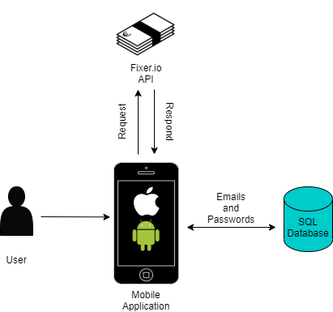

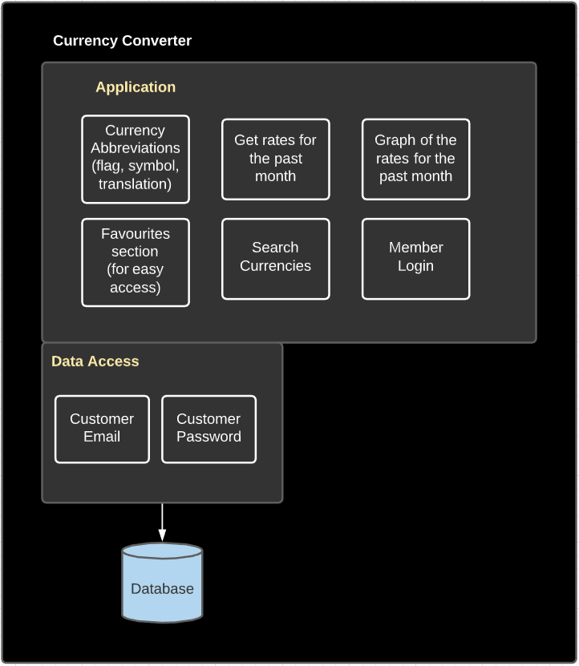

## 4.3 Services
The service is a piece of functionality that can be separately deployed and managed. The service is generally loosely coupled so that you are able to rework the service without directly impacting the rest of the architecture. For example, our application uses fixer.io as our API that gives us up to date information regarding currency conversion rates with 170 different currencies.

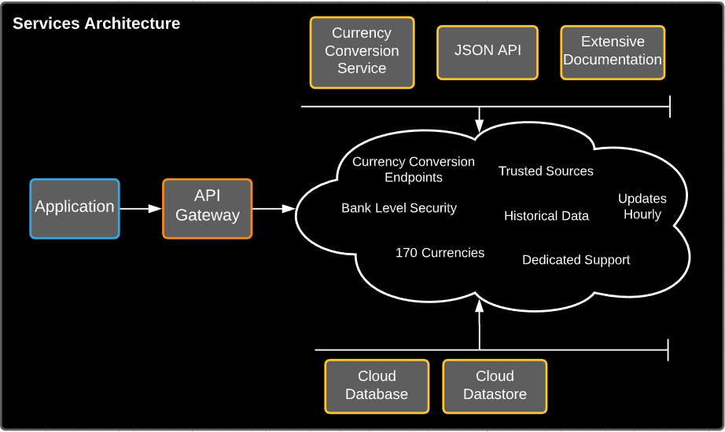

# 5 High-Level Design

## 5.1 High-Level Design DFD

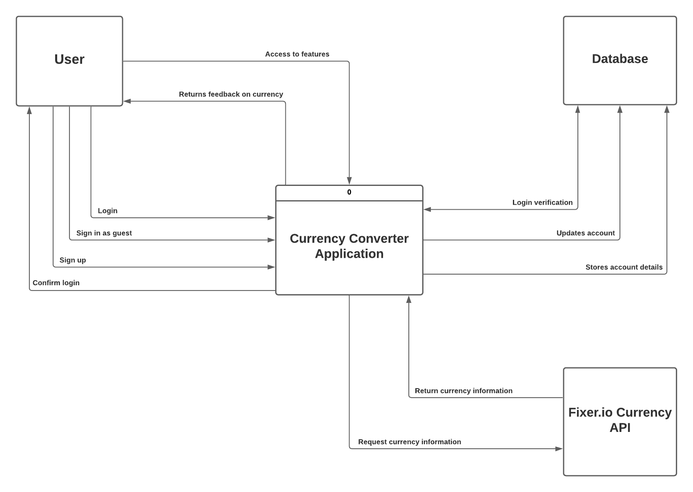

## 5.2 High-Level Design Description
Once the user logs in/signs up in the system, the system verifies the account and the user can access the features of the system. The account system allows each user to store their favourite currencies, saving it to their account information. Whenever the user requests for information, such as converting between currencies, the system queries that input to the API and the API retrieves the relevant data and the result is calculated and displayed to the user.

## 5.3 Mockup UI
**Login Screen**

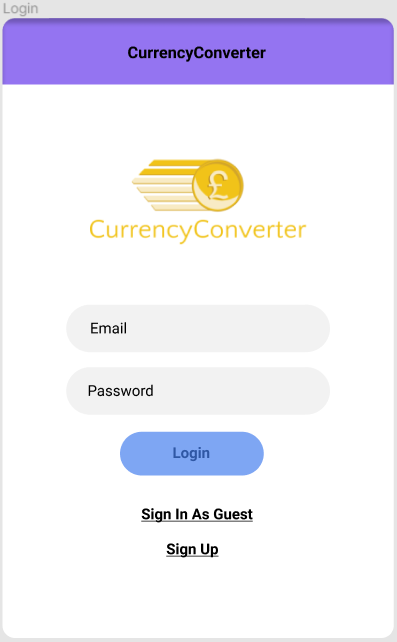

**Homepage**

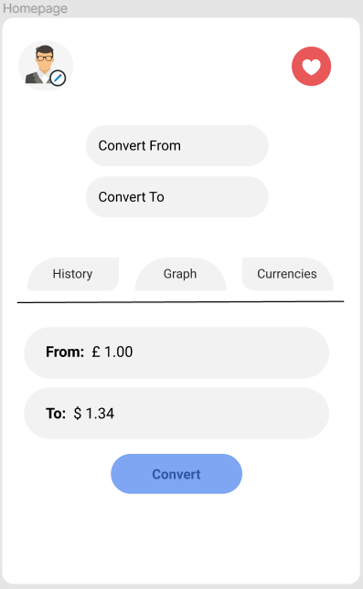

**History Section**

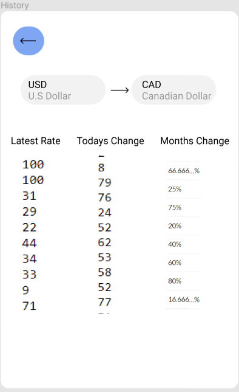

**Graph Section**

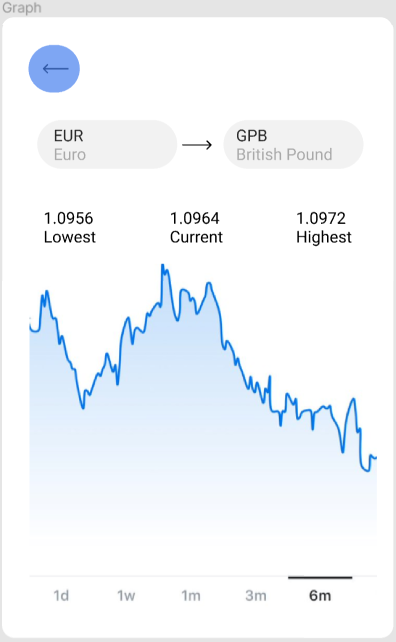

**Favourites Section**

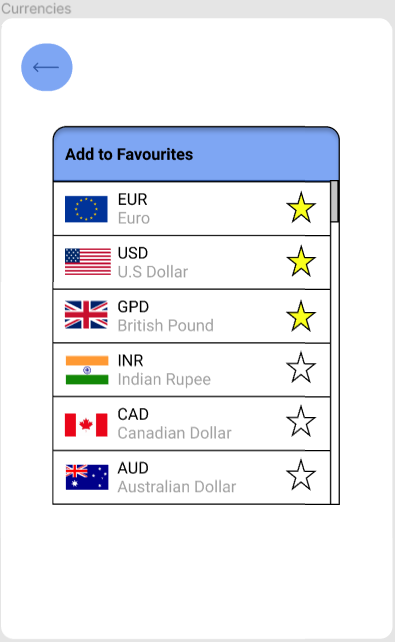

# 6 Preliminary Schedule
## 6.1 Gantt Chart

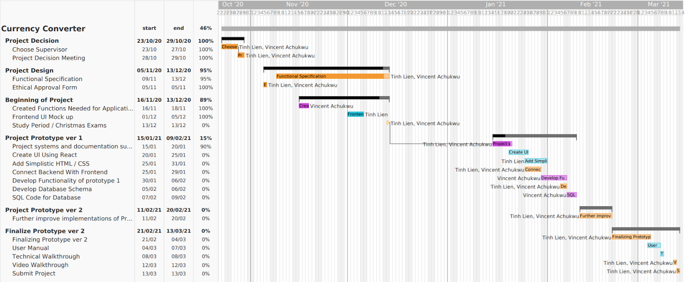

## 6.2 List View

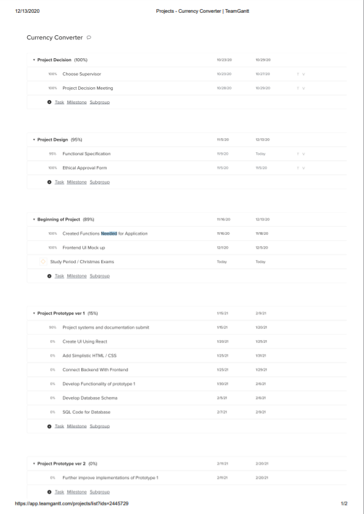
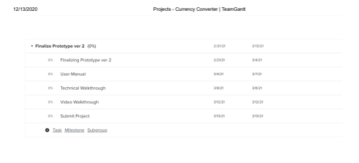
