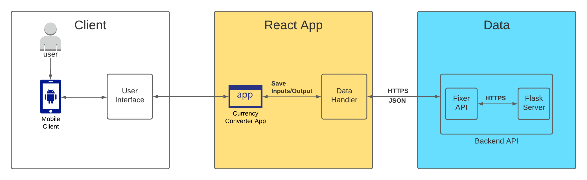
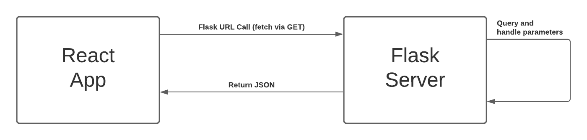
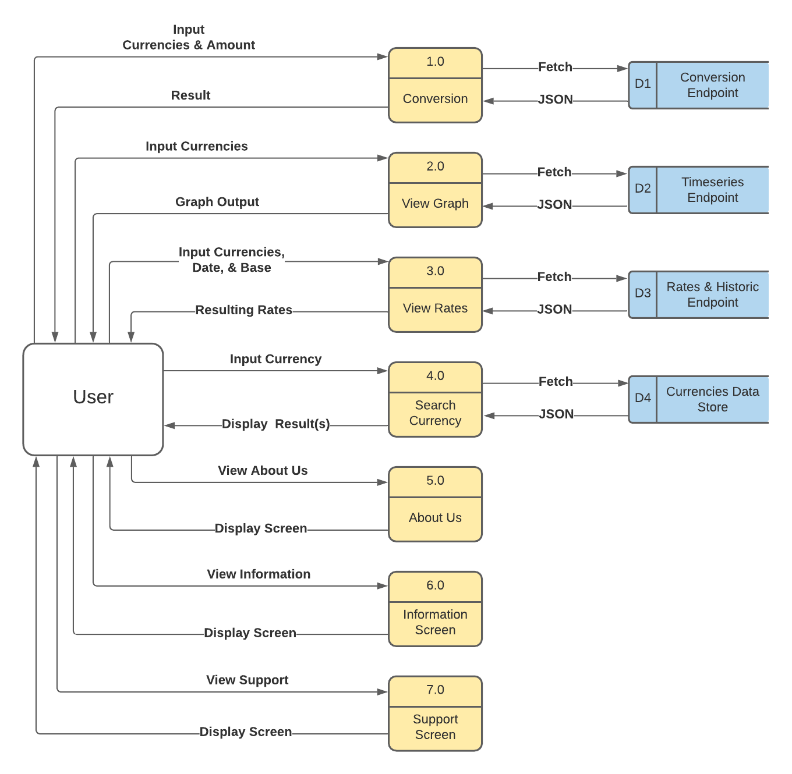

# **Technical Specification**

**Group Members:** Vincent Achukwu & Trung Tinh Lien

## **Currency Converter**

## **Table of contents**

- [1. Introduction](#1-introduction)
  - [1.1 Overview](#11-overview)
  - [1.2 Glossary](#12-glossary)
- [2. System Architecture](#2-system-architecture)
  - [2.1 Architecture Diagram](#21-architecture-diagram)
  - [2.2 Client Layer](#22-client-layer)
  - [2.3 React App Layer](#23-react-app-layer)
  - [2.4 Data Layer](#24-data-layer)
- [3. High Level Design](#3-high-level-design)
  - [3.1 Data Flow Diagram](#31-data-flow-diagram)
  - [3.2 Language Choices](#32-language-choices)
- [4. Problems and Resolution](#4-problems-and-resolution)
  - [4.1 Fixer.io API Subscriptions](#41-fixer.io-api-subscriptions)
  - [4.2 Handling Requests in Deployed Flask Server](#42-handling-requests-in-deployed-flask-server)
  - [4.3 Viewing App on Android Phone](#43-viewing-app-on-android-phone)
  - [4.4 Frontend to Backend Communication](#44-frontend-to-backend-communication)
  - [4.5 Handling of Data Across Screens](#45-handling-of-data-across-screens)
- [5. Installation Guide](#5-installation-guide)
  - [5.1 Minimum Requirements](#51-minimum-requirements)
  - [5.2 Emulator Instructions](#52-emulator-instructions)
  - [5.3 ADB Instructions](#53-adb-instructions)
  - [5.4 Device Installation Instructions](#54-device-installation-instructions)
- [6. Testing](#6-testing)
  - [6.1 Unit Testing](#61-unit-testing)
  - [6.2 Jest](#62-jest)
  - [6.3 User Testing](#63-user-testing)

# 1 Introduction

## 1.1 Overview

Currency Converter is a mobile Android application that allows users to follow the latest currency exchange rates, convert from one currency to another, specify how much a currency is worth from a given date, and a graphical representation of the trend of a currency over the last 6 weeks (i.e: same day per week, for example; if on a Monday the user wants to know how much the US Dollar is worth if they use Euro, the graph will show the USD rate over the last 6 Mondays). Upon starting the application, users will not have to sign up or log in. We originally planned to have users be able to do this in order to save currencies or conversion rates to their favourites list. During the development of this app, we realised that this feature seemed rather ineffective since simply viewing their favourite currencies didn’t add any value to the app. As well as that, due to time constraints, we couldn't further research how to store users’ favourite currencies in Firebase. If we had more time, we could’ve also stored information regarding the currency rate with the favourite currencies. The Currency Converter app also allows users to search for currencies using the search feature. Initially, we planned to have a favourites section where users can save their favourite currencies. However, we went with the search feature as it's more convenient since our app has a long list of currencies and there were difficulties implementing the favourites feature due to time constraints. Users can also view the rates of specified currencies in the rates screen by specifying which currencies they want to see the rates for, as well as optionally specifying the date and base currency.

The navigation throughout the mobile application has been improved since initially, we did not have that planned but now that it’s implemented, it significantly improved the navigation throughout the app and looks much nicer. The bottom navigation bar allows for this. Various filler screens have been added to the application also, namely, an information screen, an about us screen, and a support screen. These screens will allow users to understand how the app works, and a brief overview of who we, the developers, are.

The frontend was designed using React-Native-CLI, and the backend was developed using Flask in Python. The React Native frontend communicates with the Flask API backend by sending inputs to the Flask API endpoints, after which the Flask route is called for that endpoint and those inputs are handled. Once the backend script gets a result, it returns a dictionary response which the React Native frontend reads as JSON.

## 1.2 Glossary

| **Term**           | **Definition**                                                                       |
| ------------------ | ------------------------------------------------------------------------------------ |
| API                | Application Programming Interface, allows applications to make requests to get data. |
| App                | Mobile Application                                                                   |
| GUI                | Graphical User Interface                                                             |
| UI                 | User Interface                                                                       |
| UX                 | User Experience                                                                      |
| Server             | A computer program which maintains access to a network.                              |
| JSON               | A file format that is known as Javascript Object Notation, Data Interchange Format   |
| Android Mobile SDK | Software Development Kit for Android                                                 |
| Flask Server       | Web framework written in Python                                                      |
| USB                | Universal Serial Bus                                                                 |
| ADB                | Android Debugging Bridge, which can control a device via USB from a computer         |
| apk                | Android Package Kit                                                                  |

# 2 System Architecture

## 2.1 Architecture Diagram

## 2.2 Client Layer

The architecture diagram above represents how the mobile application interacts with the users, as well as how the components within the application interact with each other. The client layer represents components related to user interaction with the application and is responsible for displaying data. It consists of the user, the mobile client, and the interface component. Data flows from the application to the user, but the user can also interact with the application by sending inputs that are sent to the Flask backend. Examples of this include specifying the currencies for conversion, displaying the graph, searching for currencies, and viewing the historical rates with a specified date.

## 2.3 React App Layer

This layer describes the main functionality of the app, after which the data layer handles user inputs via the backend with servers. The React Native frontend sends inputs to the Flask backend, which retrieves those inputs and, if those inputs are valid, sends them to the Fixer API to obtain the results based on the inputs. Once the Flask backend retrieves the Fixer API JSON response, it restructures the result in a way such that the React Native frontend can read appropriately in order to iterate through the data to display it. The inputs and outputs are stored in the React Native code and change depending on the user input.

## 2.4 Data Layer

As for the data layer, the Flask backend restructures the output into a data structure from which the React Native frontend can read and obtain data from. The Flask backend was deployed using pythonanywhere, a tool that allows developers to deploy their Flask application online. This is where the user inputs are sent via URL API parameters which the Flask backend retrieves the inputs from. If the inputs are valid (for example, if the currencies specified for conversion are real and valid), it passes those inputs to the Fixer API and returns a JSON response. Then the Flask app reads that JSON response and restructures it to a data structure, and is then read by the React Native frontend as a JSON response. The diagram below demonstrates this.

# 3 High-Level Design

## 3.1 Data Flow Diagram

This data flow diagram illustrates how data progresses throughout the Currency Converter system, as well as how the data and processes associate with each other.

## 3.2 Language Choices

React Native is used to dealing with displaying the various components and screens for the application, as well as ensuring ease of use and navigation throughout the system. It has a great library system which allowed us to import modules to effectively make the application look more aesthetically pleasing.

Python 3 is the programming language used to deal with the Flask backend side of things. It communicates with the React Native frontend to receive inputs and send outputs, and the Fixer currency API for retrieving currencies based on those inputs from the frontend. Essentially, the Flask server is serving as the “man in the middle” which caters for handling the data for the frontend to be able to read.

# 4. Problems and Resolution

## 4.1 Fixer.io API Subscriptions

Upon starting the development of this project, we first used the free subscription plan of the Fixer.io currency API. The free subscription is limited to these features: 1,000 API calls, Hourly Updates, Limited Support, and Historical Data. We knew this was going to be a significant issue especially throughout the testing process since we would’ve had to make multiple API calls to ensure the data is sent to the Flask server which then sends it to the frontend. The backend was initially designed so we could send inputs via the terminal (i.e running the Python program on a terminal and sending inputs that way), after which the results would be displayed. This is further discussed in the blog (November 18th 2020).

We then decided that it would be best to go with the paid subscription plan (professional plan) which gave us much better features such as 100,000 API Calls, 10-minute Updates, Premium Support, Historical Data, SSL Encryption, All Base Currencies, Conversion, Endpoint, and Time-Series Endpoint. This reduced the amount of code required for calculations and handling data since the Fixer.io API can handle the data too. Essentially, the Python backend is used to restructure the JSON data returned from the Fixer.io endpoints in a way so the React Native frontend can parse effectively.

## 4.2 Handling Requests in Deployed Flask Server

After having completed the Flask backend and testing the connection between the frontend and the backend, the Flask API was deployed using pythonanywhere.com. The backend and frontend used requests to communicate with each other, where the frontend made a POST request of the inputs to the Flask API. This worked fine locally, however, the deployed version did not, as it failed to recognise that a POST request was being made to it. After searching thoroughly for solutions we figured that if the frontend passed the inputs to the Flask routes as URL parameters, this would make it easier such that all the backend has to do is GET the request arguments. This was further discussed in our blog on the 22nd and 24th February 2021.

The system works by having the frontend passing parameters to the URL endpoint (depending on the route/feature), and then fetch the data from that route via a GET request. The backend gets the parameters passed to the URL, validates the inputs, sends them to Fixer.io, and retrieves the JSON response. Then it restructures the data into a dictionary with nested dictionaries in a list so the frontend can read it as JSON when the Flask backend returns it. This was a major part of the development process in order to avoid having to specify our IP addresses every time for testing.

## 4.3 Viewing App on Android Phone

Since our application is designed for Android mobile devices, it required us to use Android Mobile SDK. Android Studio allows us to use an emulator which can mimic Android devices in order to run and view our app. However, one of us ran into an issue setting up an emulator as the emulator was not showing up. It was important for us to be able to see the application on our own setups as it would have been very inconvenient if only one of us can see the app but the other cannot. Testing would’ve been very awkward and inefficient.

We then figured out how we could view the application on our mobile devices via USB. Essentially, the USB cable must be plugged into our laptops and Android device, and USB debugging enabled on the Android device. Using ADB, it was possible to view the application with our own devices. It looked much better than it did on the emulator and felt a lot easier to use by hand.

## 4.4 Frontend to Backend Communication

This was one of the most challenging parts of the project since we have never made an Android App, or used React-Native before. Initially, the backend served as the main application via Python, where we could run the Python script on a terminal and it would call each function associated with the features to be implemented. Of course, users are not going to be using a terminal to run the application, so we advanced with the front end development and the various components started to appear in the app. The issue was getting the React-Native frontend to read the Python backend data (with hardcoded inputs to begin with), then having the frontend send data queried by the user and send it to the backend, with the backend returning the resulting data.

It took some time, but we managed to get it working using fetch in React-Native Javascript. After the user types in their queries in the text fields (for instance, for the home page currency conversion), those inputs are saved and concatenated to the conversion route URL as parameters. The fetch function is used to call to that endpoint via a GET request in order to retrieve what is returned from the Flask route that is called. The conversion route uses the function in that route to validate the inputs (i.e. making sure the currencies are of the correct length and are actual currencies, and that the amount passed in is a valid number). If valid, those inputs are sent to the Fixer.io API and the result is returned and the Flask backend restructures the output for the frontend to read as JSON data. This worked flawlessly and with almost no delay.

## 4.5 Handling of Data Across Screens

Since this was the first time using React Native or React in general, handling the data so that we could use it across the screens was difficult. For example, making a table that showed the flag, name and abbreviation of all 170 different currencies and also adding a search feature that updates with each letter typed proved to be quite a challenge.

The approach to solving this issue included making a json file containing an id number, the currency code abbreviation, the currency name and the flag. We got it so that it was showing the flag, name and abbreviation by looping through the json data however, we wanted to create the search feature as well. We got it so close, however there was an error that kept showing up to which we made a stackoverflow post about here:

*https://stackoverflow.com/questions/66354571/typeerror-undefined-is-not-a-function-near-currencyfilter-map*

# 5 Installation Guide

The Currency Converter App is available to download in the [repository](https://gitlab.computing.dcu.ie/achukwv2/2021-ca326-vachukwu), or via the CurrencyConverter.apk file located in the [code](https://gitlab.computing.dcu.ie/achukwv2/2021-ca326-vachukwu/tree/master/code/) directory for Android Devices to download.

## 5.1 Minimum Requirements

- Android Studio (4.1.2)
- Java 8
- Android Device (10.0 Q)
- Internet Connection
- Java Development Kit (JDK) 1.8
- Node.js

## 5.2 Emulator Instructions

1. Download and install Android Studio 3.0+ and React Native
2. Select “Standard” for the “Install Type” inside the installation wizard
3. Open Android Studio, navigate to Preferences > Appearance & Behaviour > System Settings > Android SDK. Click on “SDK Tools” and ensure you have Android 10.0 (Q) in the “Android SDK Build-Tools” installed
4. Remember or copy the path listed in the box that says “Android SDK Location” and add it as ANDROID_HOME to your system PATH
5. Then you need to get the path of the jre file in the Android Studio folder located somewhere like “C:\Program Files\Android\Android Studio\jre” and add it as JAVA_HOME in your PATH
6. On the Android Studio main screen, click on Configure > AVD Manager
7. Press on “Create Virtual Device”
8. Select Oreo API Level 29 and press “Download”
9. Open up two terminal windows and ensure you’re located in the code/frontend directory on both terminals
10. On one terminal window, run “react-native start”. On the other terminal window, run “react-native run-android”. This will allow the app to run on the emulator

## 5.3 ADB Instructions

1. Open up two terminal windows and ensure you’re located in the code/frontend directory on both terminals.
2. Plug in an Android Device via USB cable and ensure USB Debugging is enabled and USB configuration is set to MTP or PTP. This can be done through developer options in the device settings.
3. If your device does not have developer settings, go to Settings > About Device or About Phone > Scroll to Kernel or Build Version and tap on it 7 times
4. Enter your device PIN if it asks for it in order to enable the Developer options menu
5. The Developer Options will now be in your settings menu
6. On one terminal window, run “adb devices” to find and connect your Android device. You may get a pop-up message on your device to allow USB debugging. Press “ok”
7. Then on one terminal window, run “react-native start”. On the other terminal window, run “react-native run-android”. This will allow the app to run on the physical device

## 5.4 Device Installation Instructions

1. Locate a file called CurrencyConverter.apk” found at: *https://gitlab.computing.dcu.ie/achukwv2/2021-ca326-vachukwu/tree/master/code*
2. Copy this file to your device
3. Allow installation for “Unknown Sources”
4. Locate where you copied the file and tap “install”
5. Click “Install anyway” when the option to install the app pops up
6. Click “Install anyway” when play protect pops up
7. How to navigate and use the app can be found in the user manual

# 6 Testing

## 6.1 Unit Testing

With the backend written in Python and using the Python Flask library, we implemented unit tests for each route to ensure that the Flask server was able to receive inputs and outputs from the frontend and the Fixer.io API, respectively. We did this using Python’s PyUnit unit testing framework which sets up the parameter URLs for each endpoint and separates the good URL parameters from the bad URL parameters. Two separate loops iterate through each list and perform unit tests based on the response from the Flask server. It calls pythonanywhere.com (deployed Flask Server) and retrieves the data sent back.

It was essential to test for various inputs since the Flask backend mainly served as a data store to send to the frontend based on the inputs. Essentially, it involved checking what would happen if valid and invalid inputs were sent to the Flask server endpoints, and ensuring that the responses were ok and as expected. The Python unit tests are located in the code/backend/api directory.

## 6.2 Jest

For the frontend, Jest was set up for react-native. Jest is a JavaScript testing framework that allows us to set up testing for each screen. Some of the unit tests that were done was checking the rendering of each screen, for example, checking if a screen renders in properly for the phone. We also had to check if the buttons work as intended, so any screen that had a button we checked that if the button was pressed, an event was triggered, for example, returning “Button Pressed”. Finally, we checked for elements within a screen. These elements included the text inputs that are expected when users are typing in the blank fields.

These tests span across every screen made (a total of 8 screens). The results are saved as snapshots in the \_\_tests\_\_/\_\_snapshots\_\_ directory which gives the components and styling each screen used.

## 6.3 User Testing

Finally, we decided to conduct user testing and have users test out our application. This allowed us to better understand what problems may arise within the application from technical and non-technical users. We ensured that the users completed the consent form prior to participating in the user testing process, and their responses were kept anonymous using the Google Forms survey.

Since users may or may not be familiar with exchanging between various currencies, it was useful to get some feedback regarding the design of the application, navigability, ease-of-use, and what features may or may not have been useful. By doing this, we successfully obtained a comprehensive collection of evaluations and thoughts about the application from our users. The documentation is recorded in our repository, showing the results of the user evaluations.
