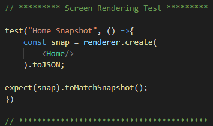
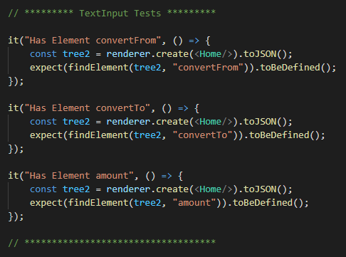
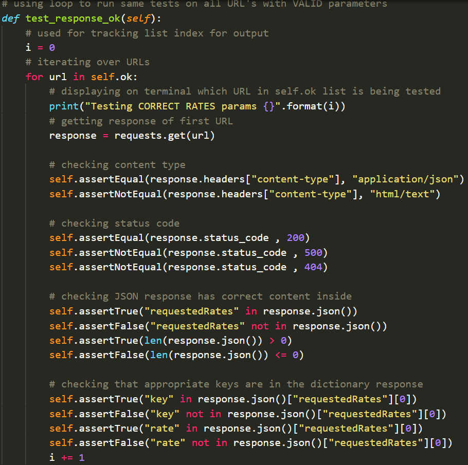
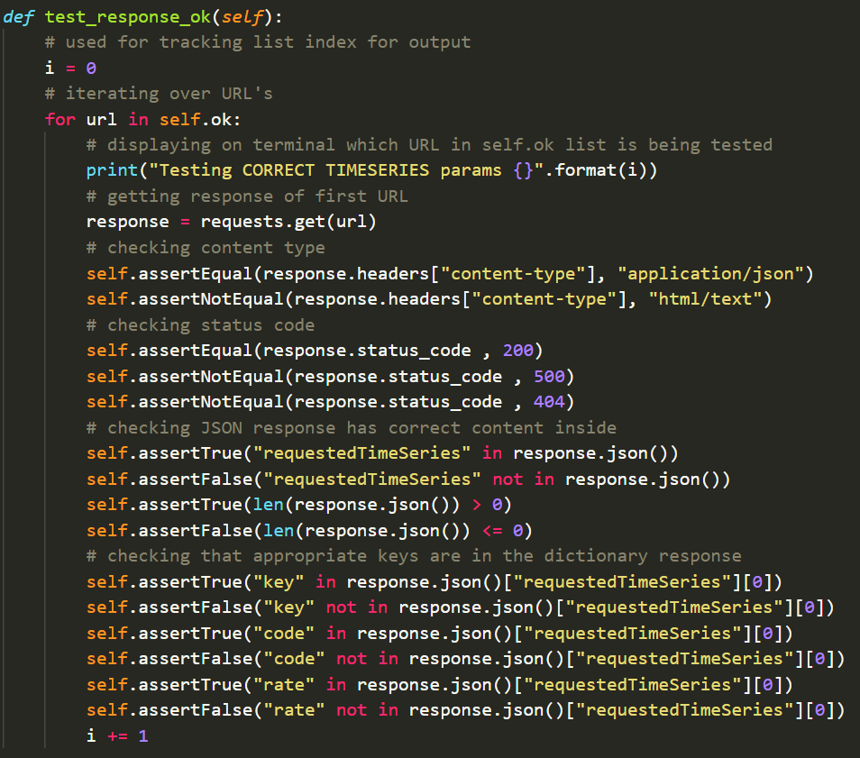

# Frontend Testing

The frontend testing consisted of using Jest, which is a JavaScript testing framework that is designed to ensure the correctness of any JavaScript codebase. The tests are run using “npm test” which will run every test in the \_\_test\_\_ directory.  

**Snapshot Tests**  
The first tests made were snapshot tests that check if a screen renders properly on a phone. The snapshots are saved into the \_\_tests\_\_ file under the \_\_snapshots\_\_ directory  

These snapshots contain details of what the screen looks like for example, the styling and colours that are associated with the screen.  

The rendering test applies to any screen that the user can see on the phone. It is important to test every single screen so that we know each screen is rendering correctly and as expected. A total of 8 screens were tested for rendering.

**Button Testing**  

The second tests that were set up were to test if buttons are actively working on the screen. The idea is that buttons serve functionality and when a user clicks the button, an activity occurs. The test ensures that the button is functioning properly on the screen since there are a lot of different ways to create a button.

Home-test.js  

Home.js  

For the buttons, we’re using `<TouchableOpacity/>` which is just another form of the `<Button>` component that has a slightly different animation. As you can see above, once the button is pressed, the `{status}` in the text field labelled as `<Text testID=”myText”>` will be updated to “button pressed”.

**Testing Elements**  

Testing the elements in the screen involves checking if `<TextInput/>` fields are showing up within the screens. The `<TextInput/>`’s are labelled with a testID that allows the testing to find it.

Home.js  

To be able to test the elements within a `<View/>` component, a function must be made to loop through the tree of the `<Home/>` screen that has been converted to a .JSON. If the tree contains any components with the `testID == element` then the result will be true, meaning that it exists.

Home-test.js  

Now using the findElement function, we are able to check for the elements that contain the testID of our choosing, in this case, the _“convertFrom”_, _“convertTo”_ and _“amount”_ `<TextInput>’s`  

These tests are created for every screen that contains such elements. A total of 8 screens and 19 test cases need to be passed.

# Backend Testing

The Flask backend testing uses Python’s PyUnit unit testing framework, which sets up the parameter URLs for each endpoint and separates the good URL parameters from the bad URL parameters. The Flask backend unit tests files are located in the code directory of the repo. The _“good”_ URL parameters contain valid and correct inputs which Fixer.io API can handle and can output data with, whereas the _“bad”_ URL parameters are invalid inputs that cannot be sent to the Fixer.io API (although it can, we need valid parameters to be sent to it). The unit tests ensure that the correct responses and data is sent from the Flask API after passing the inputs to the endpoints.

The conversion, rates, and time series unit tests all have the same structure, with the differences being the inputs sent to those endpoints and their expected JSON responses.

**Conversion Endpoint**  

Testing the conversion endpoint involves sending valid and invalid inputs to the conversion endpoint of the Flask server. The valid and invalid parameters for the URL endpoints are separated into their own list, which is then iterated through and unit tests are run per each iteration. The inputs for the conversion endpoints are the currency the user would convert from, convert to, and the amount they want to convert from.

It begins with setting up the URLs with the valid and invalid parameters to be passed to the Flask server.  

The valid and invalid URL’s are then separated into 2 lists in order to iterate through them separately and run the unit tests per iteration.  

Testing the valid URLs  

Testing the invalid URLs  

Essentially, similar tests are run for the valid and invalid URL parameters, however, the outputs would vary depending on the inputs since invalid inputs would have no data for the frontend to read other than an error message.

On each iteration, a message is outputted to the console informing the tester which URL is being tested (i.e. the index of the list being iterated).  

  

**Rates Endpoint**  

Testing the rates endpoint is done with a similar approach to the conversion endpoint testing, with the difference being that the inputs are the base currency, the date, and the currencies the user wants to know about the rates for.

The process is the same for the conversion unit testing where it begins with setting up the URLs with the valid and invalid parameters to be passed to the Flask server.  

As well as that, the valid and invalid URL’s are separated into 2 lists to test the valid and invalid URLs separately.  

Then the valid and invalid URL lists are iterated separately with unit tests applied to each URL response.

Testing the valid URLs  

Testing the invalid URLs  

When running the unit tests, a message is outputted to the console similar to the conversion unit tests, informing the tester which URL is being tested.  

**Time Series Endpoint**  

Lastly, the time series endpoint is tested for valid and invalid inputs for the URL parameters to be sent to the Flask server. This endpoint is needed for the graph to read data from, hence why we went with the paid subscription for the Fixer.io API. The inputs required here are the base currency (i.e currency the user wants to convert from) and the currency to convert to. The expected output would be the currency rates within the last 6 weeks. Since this endpoint on the Fixer.io API requires a start and end date, the Flask backend automatically sends the date range to the API with the end date being the current date.

Similarly to the above tests, the time series endpoint unit tests initiates the URLs and separates the valid and invalid URLs to their respective lists.  

  

The valid and invalid URLs are then checked against the expected outputs.  

  

  

Finally, the output of the unit tests describes which URLs are being tested based upon the index of the list.  

  

**Test Suite**  

The test suite aggregates unit tests that must be executed concurrently. The test runner arranges the execution of tests and presents the outcome to the user. Here, the test suite executes the unit tests from *test_convert*, *test_rates*, and *test_timeseries*.  

As shown below, the outputs of those tests are outputted to the console.  

