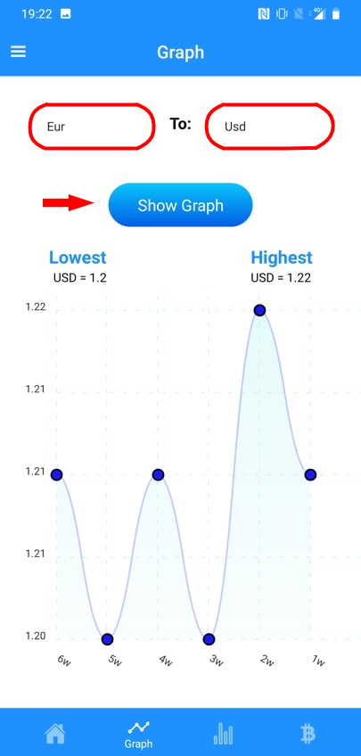
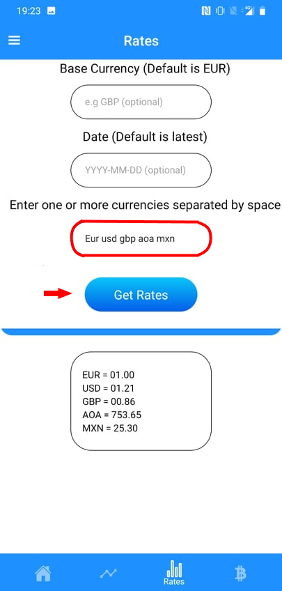

## **Table of Contents**

**0.Installation**

&nbsp;&nbsp;&nbsp;&nbsp;0.1 Minimum Android Device Requirements

&nbsp;&nbsp;&nbsp;&nbsp;0.2 Click The .apk File Link

&nbsp;&nbsp;&nbsp;&nbsp;0.3 Confirm The Installation of App

&nbsp;&nbsp;&nbsp;&nbsp;0.4 Click INSTALL When The Option To Install App Pops Up

&nbsp;&nbsp;&nbsp;&nbsp;0.5 Click INSTALL ANYWAY When Play Protect Pops Up

&nbsp;&nbsp;&nbsp;&nbsp;0.6 App Icon

**1.Welcome**

    1.1 Greeting

**2.Home Screen**

    2.1 Check Conversion Rates

**3.Graph Screen**

    3.1 View Graph

**4.Rates Screen**

    4.1 View Various Rates

    4.2 Change Different Base Currency

    4.3 View Currency Rates From the Past

**5.Search Screen**

    5.1 Table of Currencies

    5.2 Search For Preferred Currency

**6.Drawer Tab Section**

    6.1 Information

    6.2 About Us

    6.3 Support

##

## **0. Installation**

**0.1 Minimum Android Device Requirements**

Android Device Version 4.3.0

**0.2 Click The .apk File Link.**

Once provided with the universal .apk file that suits every android phone, click the link.

**0.3 Confirm The Installation of App.**

There will be a pop up that will inform you that this type of file can harm your device. Press &quot;OK&quot; here to allow the app to be installed anyways.

**0.4 Click INSTALL When The Option To Install App Pops Up**

There will be another pop up that comes up asking if you wish to install the application. Please click the &quot;INSTALL&quot; button

**0.5 Click INSTALL ANYWAY When Play Protect Pops Up**

Once Play Protect pops up because of unknown developers, click &quot;INSTALL ANYWAY&quot; to finally finish the installation process.

**0.6 App Icon**

If everything went well, there should be a new app icon called &quot;Currency Converter&quot; installed on your phone.

##

## **1. Welcome**

**1.1 Greeting**

Once you open the app, you should be greeted with a welcome screen. Once you feel welcomed enough you can head onto the Home screen by clicking &quot;Get Started&quot;.

## **2. Home Screen**

**2.1 Check Conversion Rates**

Once on the Home Screen, users are able to check conversion rates here by typing in the currency codes of the currency you wish to convert from and convert to.

## **3. Graph Screen**

**3.1 View Graph**

In the Graph screen, users are able to view the changing rates of currencies through a graph. The rates of the currency are shown once a week for a total of 6 weeks. The data is shown once the user inputs what currency they want to convert from to the currency they want to convert to. New data is shown upon currency code change.

## **4. Rates Screen**

**4.1 View Various Rates**

In the Rates screen, users are able to view multiple currency conversion rates with a default amount of 1. The base currency is default to Euro (ex. If Euro was typed in the list conversion from 1 Euro to 1 Euro would be 1) and the default date is set to the latest date. Here users can list out the currencies they wish to view.

**4.2 Change Different Base Currency**

Users can easily change the base currency by typing the currency they want to convert from in the top input section.

**4.3 View Currency Rates From The Past**

Users can also view the currency rates from the past by giving a specific date. This will show users what the currency rate was at that specific date.

## **5. Search Screen**

**5.1 Table of Currencies**

The purpose of the Search screen is so users can check for the currency code of the currency they are searching for the table is listed in alphabetical order.

**5.2 Search For Preferred Currency**

Instead of scrolling through the table of 170 different currencies, users are able to search for the currency they are looking for making it more efficient.

##

##

## **6. Drawer Tab Section**

The drawer tab is located on the top left corner of the app users can click the menu icon or swipe right on the left side of the screen to open this menu. It contains screens that inform and helps the user if required.

 

**6.1 Information**

The information screen provides users with information about the API we use. From here users can confirm that the sources we use are trusted. A link is provided to provide further information about the API.

**6.2 About Us**

In the About Us Screen users can find out more about the developers. Links to their socials which includes the source code for the application are provided.

**6.3 Support**

Finally, the support screen provides detailed information about how to use the application if users were to get stuck. It contains text that explains what to do along with images that show the step by step guide to using the application.

 

 
